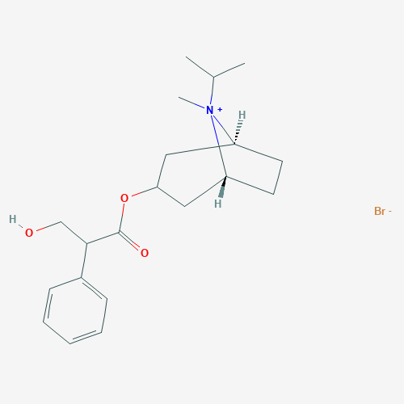
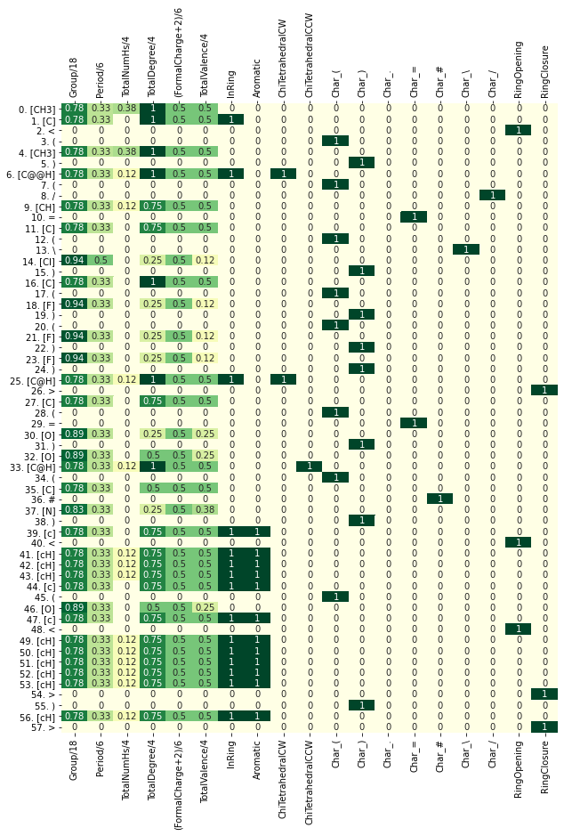

# SMILearn
A feature engineering package for deep learning models, based on a SMILES 
representation of chemical compounds.  
Enables fast customization and testing of feature matrices.
## Getting started <small>*(no installation required)*</small>
Before installation one can try a demo of this package by opening `demo.ipynb` notebook in Google Colab.<br/><br/>
[](https://colab.research.google.com/github/mateuszrezler/smilearn/blob/master/demo.ipynb)

This notebook contains complete practical example of usage and basic documentation of the package (section 2.3).
## Installation
The easiest way to recreate environment on a local host is to install Anaconda or Miniconda and buid it from the attached `smilearn.yml` file
```shell
# clone this repository
$ git clone https://github.com/mateuszrezler/smilearn.git

# create environment
$ cd smilearn
$ conda env create -f smilearn.yml

# activate environment
$ conda activate smilearn

# run demo
$ jupyter notebook smilearn.ipynb
```
or download and run [`setup.sh`](setup.sh) file
## Example
Ipratropium bromide and heatmap of its feature matrix generated using this package.<br/>


